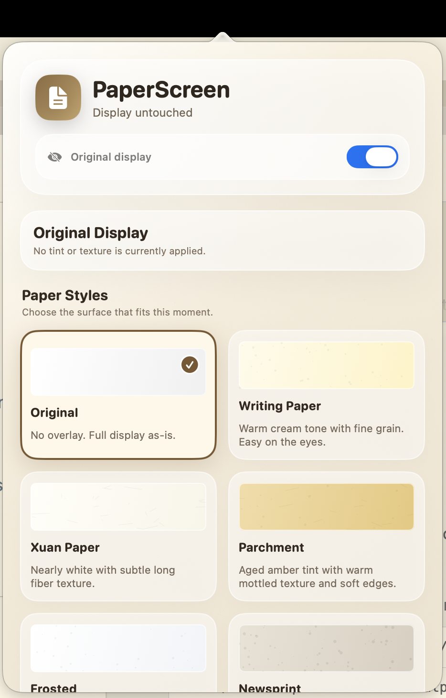

# PaperScreen

**Make your Mac screen feel like paper.**

PaperScreen is a lightweight macOS menu bar utility that places a subtle, click-through overlay on every display — softening harsh brightness and adding a gentle paper-like tone and texture.




---

## Why

Bright apps — VS Code, Safari, Notes, PDFs, documentation — can feel harsh, especially at night. PaperScreen adds a warm, paper-like tone and texture to your whole display without touching any app settings, requiring any permissions, or recording your screen.

It's the useful part of PaperDisplay's preset concept, with a cleaner native UI.

---

## Features

- **Paper presets** — Original, Writing Paper, Cotton Paper, Xuan Paper, Rice Paper, Parchment, Frosted, Cardstock, Newsprint
- **One simple control** — Intensity from 0% to 200%
- **Pause 20 min** — temporarily lift the effect for color-sensitive work
- **Night Comfort** — one-tap warm preset optimised for late-night use
- **Compare Original** — toggle to instantly see your display before and after
- **Multi-display** — one overlay per screen, tracks plug/unplug automatically
- **Cover fullscreen Spaces** — optional higher window level for fullscreen apps
- **Dark Mode aware** — automatically reduces the effect in dark environments
- **Launch at Login** via `SMAppService`
- **No screen recording** — purely a composited overlay; zero permissions required
- **Zero CPU when idle** — no polling, no timers running in steady state

---

## Presets

| Preset | Tint | Feel |
| --- | --- | --- |
| **Original** | none | Untouched display |
| **Writing Paper** | warm cream `#FFF6DA` | Soft everyday surface with fine grain |
| **Cotton Paper** | soft white `#FFFAEE` | Premium stationery with a calm cotton surface |
| **Xuan Paper** | near-white `#FFFDF3` | Minimal tint with long fiber texture |
| **Rice Paper** | translucent cream `#FFFCEF` | Thin handmade paper with visible natural fibers |
| **Parchment** | amber `#F0D28A` | Aged warmth with mottled texture and soft edges |
| **Frosted** | white `#FFFFFF` | Cool frosted noise, clean and bright |
| **Cardstock** | matte cream `#F7E9C8` | Thick low-glare paper surface |
| **Newsprint** | gray `#E5DDCE` | Low-contrast reading feel with visible grain |

---

## Installation

### Download from GitHub Releases

1. Download `PaperScreen-<version>-macOS.dmg` from the latest GitHub Release.
2. Open the DMG.
3. Drag `PaperScreen.app` to `Applications`.
4. Launch PaperScreen from Applications and use the menu bar icon.

### Build from source

1. Clone the repository
2. Open `PaperScreen.xcodeproj` in Xcode 15 or later
3. Select the **PaperScreen** scheme and build (`⌘B`)
4. Run — the app appears in your menu bar

Or from the terminal:

```sh
xcodebuild -project PaperScreen.xcodeproj -scheme PaperScreen -configuration Release build
```

Create GitHub Release artifacts:

```sh
./Scripts/package_release.sh
```

The script writes a `.dmg` and `.zip` to `dist/`.

> **Requirements:** macOS 13 Ventura or later. No dependencies, no package manager.

---

## How it works

PaperScreen creates one borderless `NSPanel` per display. Each panel:

- Is fully **click-through** (`ignoresMouseEvents = true`)
- **Never captures your screen** — it is a composited transparent window layered by the window server
- **Joins all Spaces** and follows Mission Control automatically
- Renders three composited layers: a warm tint, a tiled procedural texture, and an optional edge vignette

Textures are generated at launch using a seeded RNG and cached in memory — no image files, deterministic across runs.

---

## Privacy

- **No screen recording** — the overlay does not read, sample, or transmit pixel data
- **No Accessibility access** — no automation, no window scanning
- **No network requests** — fully offline
- **Local settings only** — all preferences stored in `UserDefaults` on your Mac

---

## License

MIT — see [LICENSE](../LICENSE) for details.
